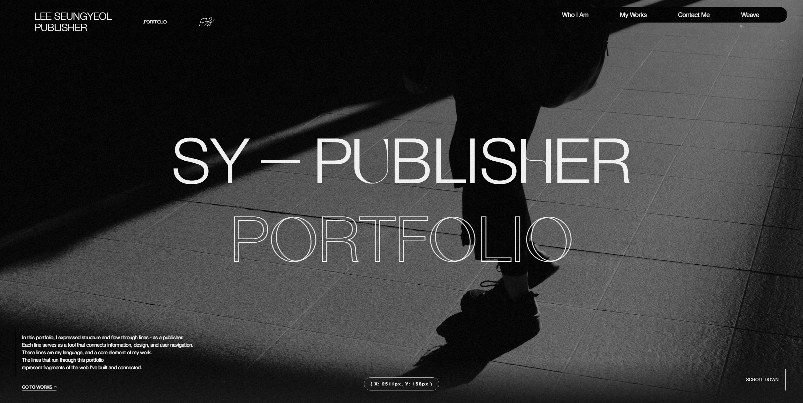

# Lee Seungyeol — Portfolio

웹·UI 퍼블리셔 **이승열**의 포트폴리오 웹사이트 저장소입니다.

**사이트:** [https://seungyeol.kr](https://seungyeol.kr)



---

## 소개

프로젝트 아카이브, About, Contact 등을 담은 포트폴리오입니다.  
오프닝 인트로, 스크롤 스무딩, 커스텀 커서·노이즈 배경 등 인터랙션과 반응형 레이아웃을 중심으로 구성했습니다.

---

## 기술 스택

| 구분          | 사용 기술                                             |
| ------------- | ----------------------------------------------------- |
| 마크업·스타일 | HTML, CSS                                             |
| 스크립트      | JavaScript (ES Modules), TypeScript (React 앱)        |
| UI·라우팅     | React 19, React Router                                |
| 빌드          | Vite 5                                                |
| 애니메이션    | GSAP (ScrollTrigger, ScrollSmoother, ScrambleText 등) |
| 페이지 전환   | Swup (정적 멀티 페이지)                               |

---

## 저장소 구조

```
├── index.html, about.html, works.html, work.html, contact.html  # 정적 멀티 페이지
├── assets/                 # 공통 CSS·JS·이미지·폰트
├── react-app/              # 동일 콘셉트의 React + Vite 버전
│   ├── src/
│   └── public/assets/      # 정적 자산(빌드 시 그대로 제공)
└── README.md
```
